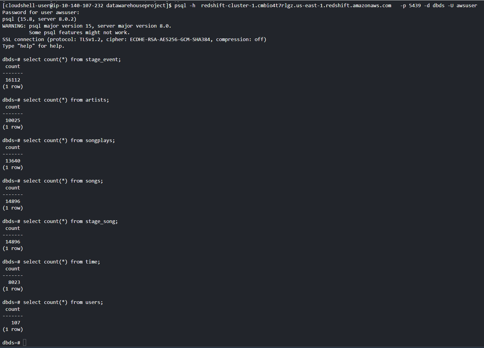
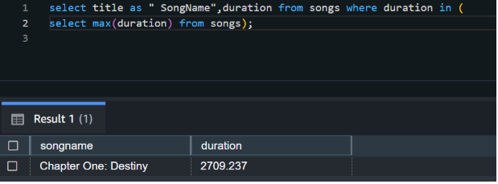
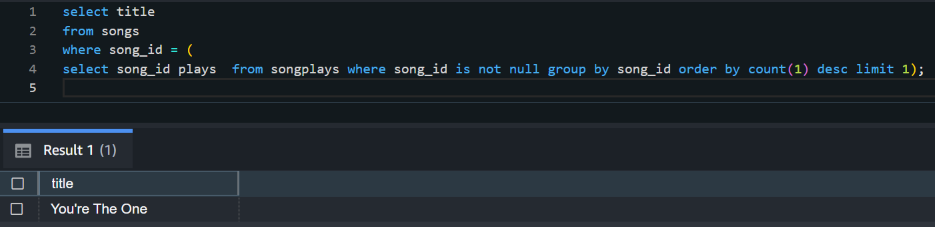
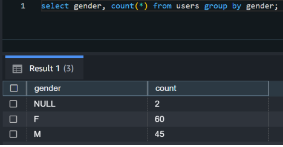
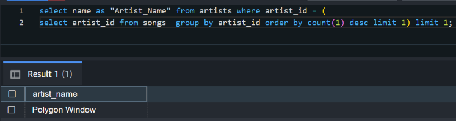
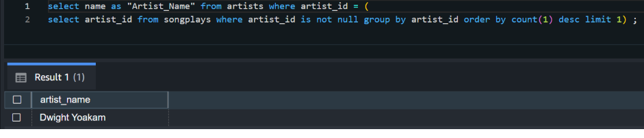

# Project: Data Warehouse

## Project Description
In this project we will create a Redshift DB with user activity and songs. The data will be loaded from S3 bucket that contains JSON files.
Once data is loaded and transformed into dimensional tables we can run the sql queries to find insights for our interest.

## Project Files Description

- dwh.cfg - contains the info for redshift database and IAM role 
- create_cluster.py - it will drop and create the fact and dimension tables empty in the Redshift DB
- etl.py - it will load data from S3 into staging tables on Redshift and then process that data into the analytics tables on Redshift.
- sql_queries.py - it contains the definition for the SQL statements: create table DDLs, the insert statements and copy commands.

## Project Files Execution

Steps that were done to complete this project:
- Create the IAM role which had assigned: AmazonS3ReadOnlyAccess and AmazonRedshiftAllCommandsFullAccess
- Create the security group that authorise redshift cluster acces
- Create the Redshift cluster
- Run the command to drop and recreate the tables:
     > $ python create_table.py
- Run the ETL command:
     > $ python etl.py

- From AWS console open the Redshift query editor to verify the tables
- Delete the IAM role and theRedshift cluster

## Project Output

Rows count per table:

 ### Query examples for song play analysis

 #### 1. Title for the longest song:
  
  
 #### 2. Title for the most played song:
 
 
 #### 3. Gender proportions:
 
 
 #### 4. Artist with the highest number of songs:
 
 
 #### 5. Artist with the most song plays:
  
  

